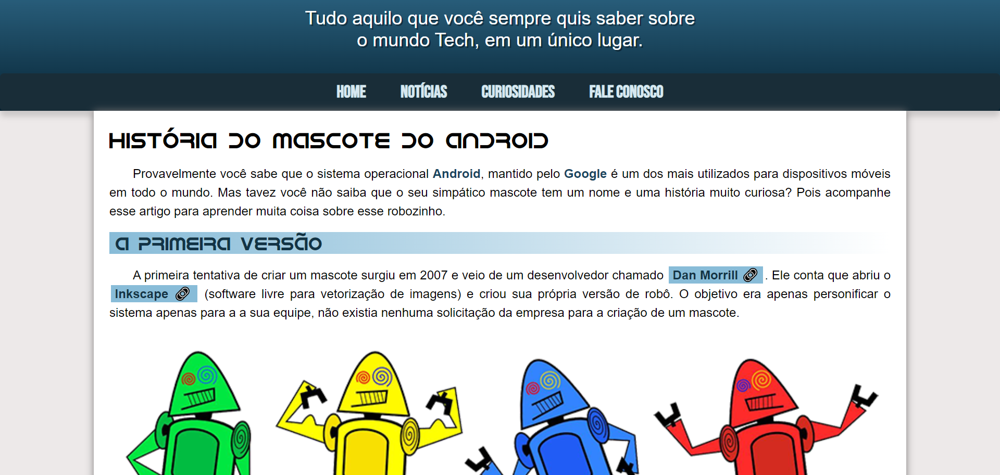

# Curso de HTML5 e CSS3

>Site sobre o Android

Projeto desevolvido através dos conhenhecimentos obtidos no cursos lecionados pelo professor Gustavo Guanabara, Curso em Vídeo.
Nesse site o usuário vai coseguir compreender a evolução do Android ao longo dos anos com vídeos e links interativos.

[🔗 Clique aqui para acessar](https://ramonbarret.github.io/site_android/)

## 🛠 Tecnologias

- HTML5
- CSS3
- Git e Github

## 📲 Contato

Email: ramon_barreto_medrado@hotmail.com